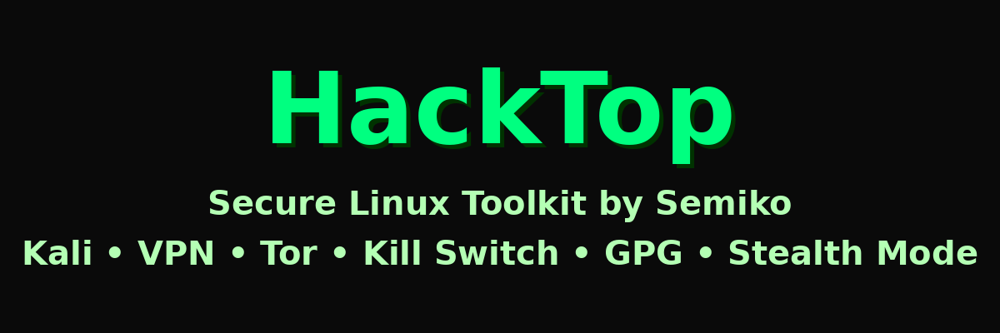

<p align="center">
  
</p>


# HackTop – NetControl v1.2 SUPREME

🛡️ HackTop on Kali Linuxille suunniteltu kyberturvatyökalu, joka yhdistää anonyymiyden, VPN:n, Torin ja useita OPSEC-toimintoja. Se on tehty eettiseen hakkerointiin, tietoturvatestaukseen ja yksityisyyden suojaan.

---

## 📥 Asennus

```bash
git clone https://github.com/krista1000/hacktop.git
cd hacktop
chmod +x *.sh
./netcontrol-setup.sh
```

---

## 🚀 Käyttö

Käynnistä ohjattu valikko:

```bash
./netcontrol.sh
```

Valitse ominaisuudet nuolinäppäimillä tai numeroilla: VPN, Tor, stealth-tila, MAC-spoofaus, DNS-testi, liikenteen valvonta jne.

---

## 🔧 Ominaisuuksia

- 🔐 VPN + Tor + Kill Switch
- 🧱 MAC-randomisointi, liikenteen valvonta
- 📤 VPN-profiilin vienti GPG-salauksella
- 🖥️ Työpöytäpikakuvake ja piilotettu autostart
- 🎨 ASCII ZSH-prompt HackTop-brändäyksellä
- 🧪 DNS Leak -testi ja IP-jäljen tarkistus
- 📦 Täysi asennus yhdellä komennolla

---

## ⚙️ Vaatimukset

- Kali Linux / Debian-yhteensopiva
- `dialog` tai `whiptail`
- `wireguard-tools`, `tor`, `gpg`
- `nmap` (valinnainen)

---

## 📜 Lisenssi

MIT – vain koulutus- ja eettiseen käyttöön  
💜 Tekijä: Semiko – HackTop-tiimi

---

# HackTop – NetControl v1.2 SUPREME (ENGLISH)

🛡️ HackTop is a stealth-ready cybersecurity toolkit for Kali Linux. Automates VPN, integrates Tor, supports Kill Switch, GPG encryption, MAC spoofing, DNS leak checks, and more – made for ethical hacking and OPSEC.

---

## 📥 Installation

```bash
git clone https://github.com/krista1000/hacktop.git
cd hacktop
chmod +x *.sh
./netcontrol-setup.sh
```

---

## 🚀 Usage

Launch the control menu:

```bash
./netcontrol.sh
```

Use arrow keys or numbers to select modules: VPN, Tor, stealth mode, MAC spoofing, DNS checks, traffic monitor, etc.

---

## 🔧 Features

- 🔐 VPN/Tor + Kill Switch
- 🧱 MAC randomization, traffic monitor, DNS safety
- 📤 Exportable VPN profiles with GPG encryption
- 🖥️ Desktop shortcut & stealth autostart
- 🎨 ZSH prompt with HackTop ASCII branding
- 🧪 DNS Leak test & IP trace check
- 📦 Full setup via netcontrol-setup.sh

---

## ⚙️ Requirements

- Kali Linux (or Debian-compatible)
- `dialog` or `whiptail`
- `wireguard-tools`, `tor`, `gpg`
- `nmap` (optional)

---

## 📜 License

MIT License – for educational and ethical use only.  
Made with ❤️ using Kali Linux by Semiko.
